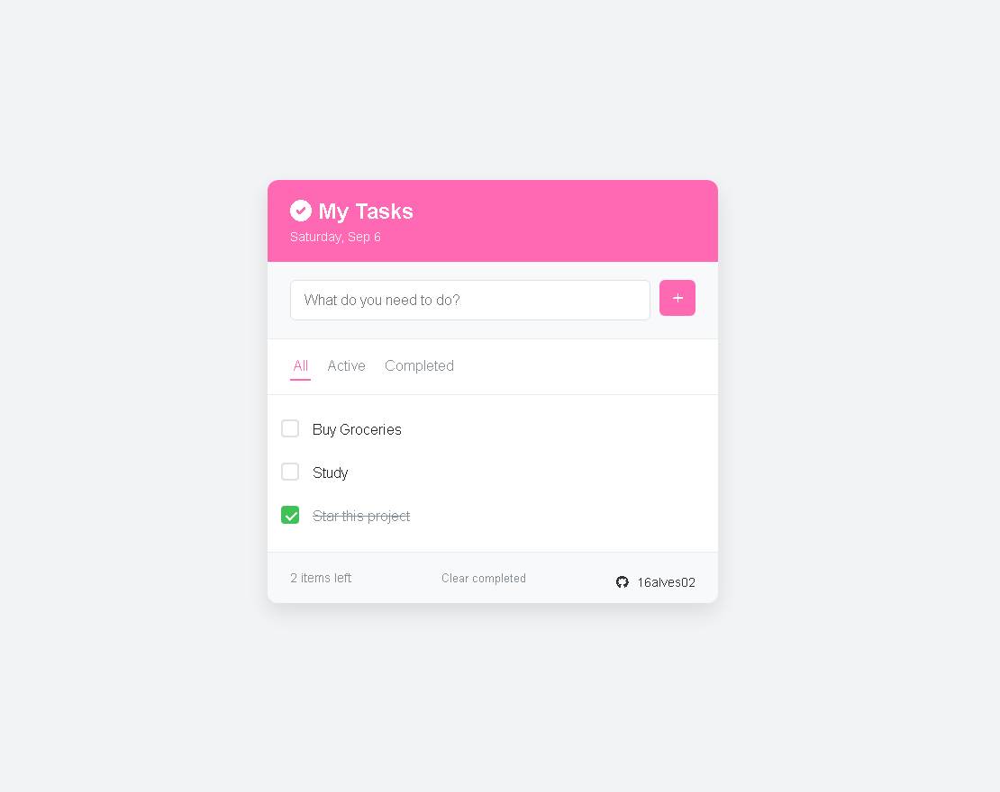

# 🚀 Todo App

[](https://developer.mozilla.org/en-US/docs/Web/HTML) 
[](https://developer.mozilla.org/en-US/docs/Web/CSS) 
[](https://developer.mozilla.org/en-US/docs/Web/JavaScript) 
[](LICENSE)

A sleek, modern **Todo application** built with HTML, CSS, and JavaScript. Manage your tasks efficiently with a clean, user-friendly interface and persistent storage using `localStorage`.

---

## 🌐 Live Demo
[Check it out here](https://todo-app-three-beta-56.vercel.app) 🔥

---

## 💡 Features

- ✨ Add new tasks via input or by pressing **Enter**
- ✅ Mark tasks as **completed** with a custom checkbox
- ❌ Delete individual tasks or clear all completed tasks
- 🔎 Filter tasks: **All**, **Active**, **Completed**
- 💾 Persistent tasks using `localStorage`
- 📱 Responsive, mobile-friendly design
- 📅 Displays **today's date** dynamically
- 🎨 Modern UI with **Font Awesome icons** and hover effects
- 🗂️ Empty state message when no tasks are present

---

## 🛠️ Tech Stack

- **HTML5** – Semantic and structured layout
- **CSS3** – Custom styling with CSS variables and responsive design
- **JavaScript (ES6)** – DOM manipulation, event handling, and `localStorage`
- **Font Awesome** – Icons for enhanced UI elements

---

## 📦 Installation

1. Clone the repository:
   ```bash
   git clone https://github.com/16alves02/todo-app.git
   ```
2. Navigate to the project folder:
   ```bash
   cd todo-app
   ```
3. Open `index.html` in your browser. No build step or dependencies required! ✅

---

## ⚡ Usage

- Type a task in the input field and press **Enter** or click the **+** button to add it.
- Mark tasks as completed using the checkbox.
- Delete individual tasks with the **x** button.
- Filter tasks by clicking **All**, **Active**, or **Completed**.
- Clear all completed tasks with the **Clear completed** button.
- Tasks persist across sessions using `localStorage`.

---

## 📸 Screenshot



---

## 👨‍💻 Author

- **GitHub**: [16alves02](https://github.com/16alves02)
- Made with ❤️ and JavaScript magic.

Level up your productivity and keep your tasks in check! ⚡
