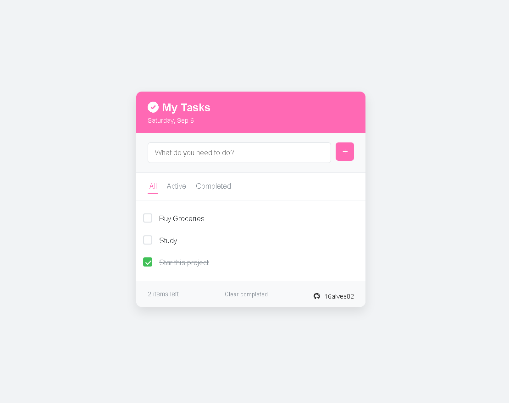

# ✅ Todo App

> **A small task manager built from the browser up.**

[](https://todo-app-three-beta-56.vercel.app)
[](https://developer.mozilla.org/en-US/docs/Web/HTML)
[](https://developer.mozilla.org/en-US/docs/Web/CSS)
[](https://developer.mozilla.org/en-US/docs/Web/JavaScript)
[](LICENSE)

## 🌐 Live Demo

**[Open Todo App](https://todo-app-three-beta-56.vercel.app)**

## 📌 About

**Todo App** is a lightweight task manager built with **HTML, CSS and vanilla JavaScript**, without a frontend framework or build system.

The project focuses on the fundamentals behind a browser-based application: capturing user input, updating the DOM, managing application state, filtering data and persisting information locally.

It started in **2025** and was revisited in **2026** with improvements to the code comments, structure and documentation.

## ✨ Features

### 📝 Task Management

- Add new tasks
- Add tasks with the **Enter** key or the **+** button
- Mark tasks as completed
- Unmark completed tasks
- Delete individual tasks
- Clear all completed tasks

### 🔎 Filtering

Switch between:

- **All**
- **Active**
- **Completed**

The interface updates the visible task list according to the selected filter.

### 💾 Local Persistence

Tasks are stored in the browser using:

```text
localStorage
```

This means the task list can remain available between browser sessions on the same device and browser.

### 📅 Dynamic Interface

The application also:

- Displays the current date
- Shows how many tasks remain incomplete
- Displays an empty-state message when there are no tasks
- Uses Font Awesome icons for interface actions
- Provides a responsive layout for smaller screens

## 🧩 How It Works

The application is intentionally simple:

```text
User input
    ↓
JavaScript event
    ↓
Todo state
    ↓
DOM rendering
    ↓
localStorage
```

There is no backend. The browser is responsible for the application state and local persistence.

## 🛠️ Tech Stack

| Technology | Role |
| --- | --- |
| HTML5 | Page structure |
| CSS3 | Layout, visual design and responsive behaviour |
| JavaScript ES6+ | Application logic and DOM interaction |
| Font Awesome | Interface icons |
| localStorage | Local task persistence |

## 📁 Project Structure

```text
todo-app/
├── assets/
│   └── screenshot.png
├── index.html
├── scripts.js
├── styles.css
├── LICENSE
└── README.md
```

The project deliberately keeps the structure small, making it easy to understand how each layer contributes to the final application.

## 🚀 Getting Started

No installation, package manager or build step is required.

### Clone

```bash
git clone https://github.com/16alves02/todo-app.git
cd todo-app
```

### Run

Open `index.html` directly in a modern web browser.

## 📸 Preview



## ⚠️ Scope & Limitations

- The application has no backend or user account system.
- Tasks are stored only in the browser's `localStorage`.
- Data is therefore local to the browser and device where the application is used.
- There are no automated tests in the repository, so verification is based on manual interaction with the interface.

## 🧠 What I Learned

This project is a practical exercise in:

- DOM manipulation
- JavaScript event handling
- Managing UI state
- Array operations
- Conditional rendering
- Browser storage
- Responsive CSS
- Structuring a small application without a framework

The project shows the progression from static web pages towards interactive browser applications.

## 🗓️ Project History

- **2025** - Initial project and core application.
- **2025** - HTML, CSS and JavaScript functionality developed around the task manager flow.
- **2026** - Code comments and structure revisited.
- **2026** - Documentation and copyright information refreshed.

## 👤 Author

**Leonardo Alves - [@16alves02](https://github.com/16alves02)**

Part of the **16alves02** project portfolio.

## 📜 License & Copyright

**Copyright (c) 2025-2026 Leonardo Alves (16alves02). All rights reserved.**

This project is **not open source**. The source code is published for viewing and educational reference, but it may not be copied, redistributed, modified for public or commercial use, sublicensed, sold, or presented as someone else's work without prior written permission.

See the [LICENSE](./LICENSE) file for the full terms.
